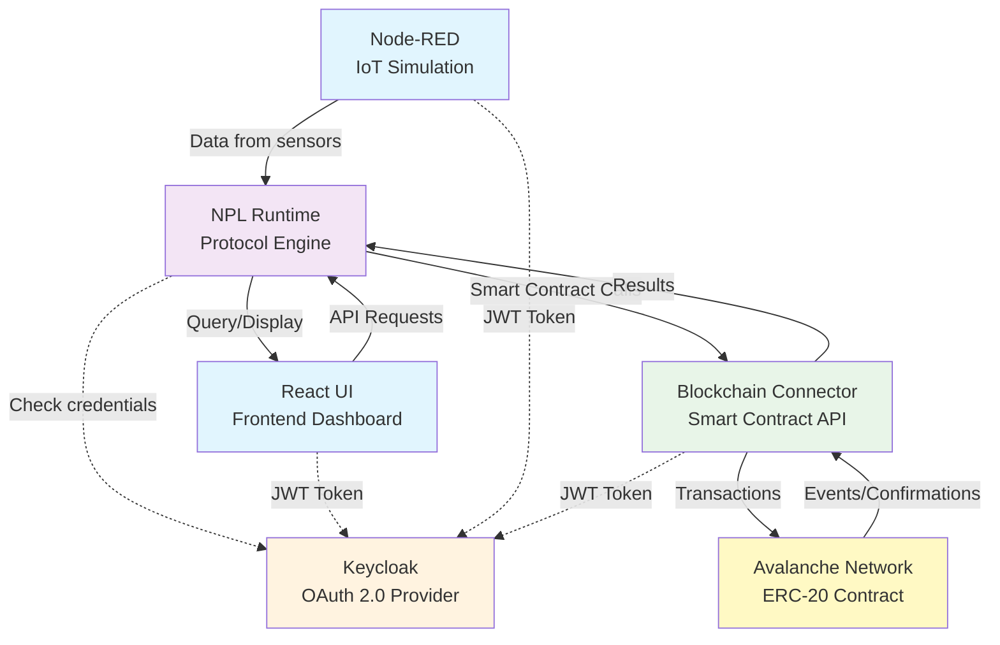
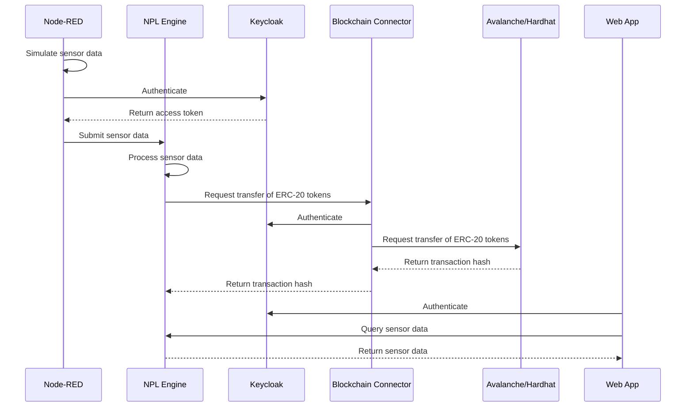
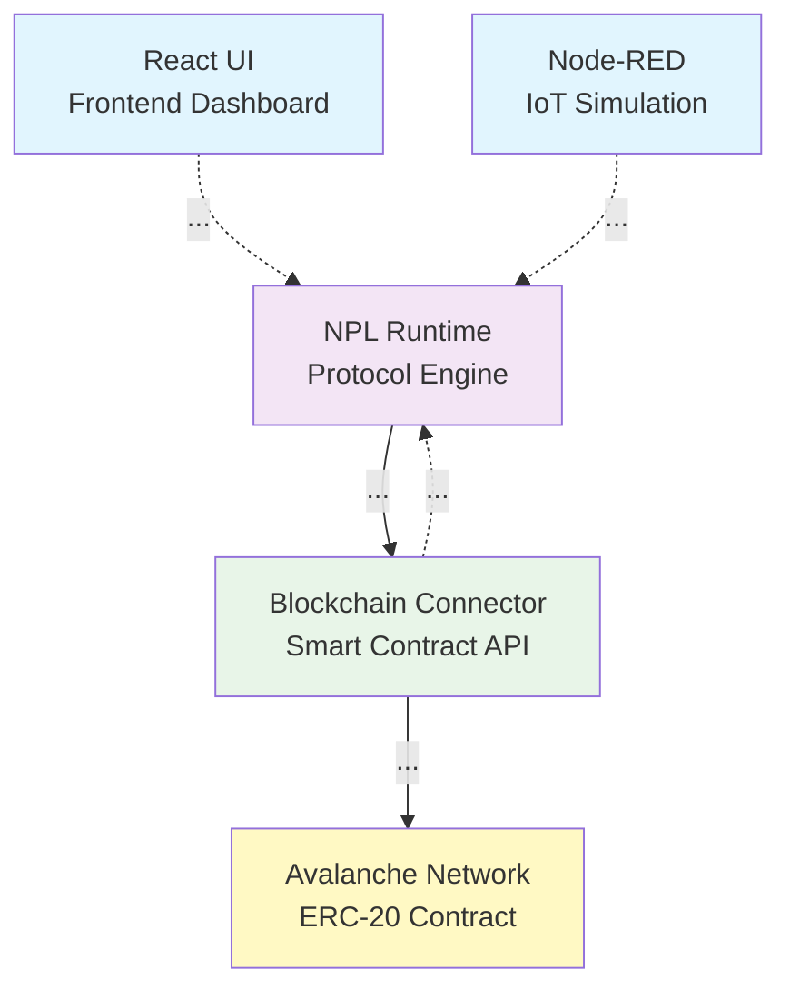

# IoT Smart Energy Billing Tutorial

## Overview

This tutorial teaches you how to build a complete IoT-to-blockchain system modelling a solar energy production system, where device owners are paid for the energy they produce. The system will be able to track the energy production and the energy consumption of the devices, and pay the device owners for the energy they produce through ERC-20 tokens. You'll learn the fundamentals of IoT integration, blockchain development, and decentralized application architecture.

## Learning Objectives

By the end of this tutorial, you will:
- Understand IoT device integration with blockchain systems
- Deploy and interact with ERC-20 smart contracts
- Build automated billing workflows using NPL protocols
- Create responsive frontend interfaces for blockchain data
- Implement secure authentication and authorization

## Use Case: On-chain sensor data

We'll build a smart energy billing system that:

1. **Gathers** sensor data from IoT devices
2. **Processes** and stores sensor data according to business logic
3. **Triggers** blockchain transactions for billing
4. **Executes** automatic payments via ERC-20 tokens
5. **Displays** usage and billing data in a web dashboard

In this tutorial, we will assume that the number of tokens is defined by the IoT device. This amount will be paid to the customer as DeviceConsumptionTokens.

## Architecture Overview

Noumena offers a tech platform that provides an easy integration with blockchain and IoT devices. It allows you to develop your application without having to worry about the infrastructure and integration into the blockchain network.

> Install the Mermaid extension in VS Code to see the diagrams.



**Component Responsibilities:**
- **Node-RED**: Simulates IoT devices sending sensor data
- **UI (Frontend)**: React dashboard for monitoring and control
- **IAM (Keycloak)**: OAuth 2.0 authentication and authorization
- **NPL Runtime**: Business logic engine processing sensor data
- **Blockchain Connector**: Interface between NPL and smart contracts
- **Blockchain**: Avalanche network hosting the ERC-20 contract

## Sequence Diagram



---

## Prerequisites

Verify your installation as described in the [README](README.md).

As you are on the exercise branch, you will not be able to see results in the frontend. Once this exercise is complete, you will be able to see the results in the frontend.

## Flow

1. Design your use-case: Sensor data — off-chain — blockchain
2. Auth: users and credentials (Keycloak & NPL Party model)
3. NPL: Implement your protocols
4. Node-RED: Feed IoT events to NPL (Simulate IoT devices)
5. Blockchain: Implement your smart contract (ERC-20)
6. NPL: Process the events and trigger the smart contract
7. Frontend: Display the data and history

### Part 1: Design your use-case

The use-case is to send the iot data to the blockchain smart contract, using the Noumena tech platform as storage and logic layer, as well as connector to the blockchain network.

In addition to the infrastructure, we need to define the data flow.

From the source of data, the NodeRED, to the sink, the blockchain smart contract, design the data flow, including the data format and submission frequency.

**🔍 Exercise 1.1:** Define the data objects generated by the IoT device

Data generated by the iot device:

- ...
- ...

Frequency:

- ...

**🔍 Exercise 1.2:** Define the data objects generated by the NPL engine

Data stored in the NPL engine:

- ...
- ...

Given that NPL receives data from the iot device, the frequency is the same as the iot device.

**🔍 Exercise 1.3:** Define the data objects generated by the smart contract

Data received and stored by the smart contract:

- ...
- ...

### Part 2: Authorization end-to-end

The Noumena tech requires all actions to be authenticated and authorized. This is done using Keycloak and the party model.
For all API calls to the NPL Engine, a JWT token is required.

As you know, for calls to the blockchain connector, a wallet is required. So we need to define the roles of the system that map to parties in NPL.

**🔍 Exercise 2.1:** Define the roles for the system.

Fill in the diagram below with the roles for the system. There are 5 places to fill in the roles.



These role will be used in NPL to grant access to the objects and trigger actions in the system.

For more information about the party model, see [Appendix A: NPL Party Model](appendix-a-npl-party-model).

### Part 3: NPL Protocol Development

NPL, the Noumena Protocol Language, is a programming language for building business logic run by the NPL Runtime.

The NPL Runtime is a service that can be deployed either:
- **Locally**: Using the provided Docker containers
- **Noumena Cloud**: On the managed cloud infrastructure

The NPL Runtime provides:
- **Protocol execution**: Runs NPL business logic protocols
- **State management**: Maintains device states
- **Event processing**: Handles consumption events and blockchain callbacks
- **API endpoints**: REST APIs for external integrations

An example of an NPL protocol is on [the NPL documentation](https://documentation.noumenadigital.com/#npl).

In this part, we will setup the protocol for the device that sends the iot data. The smart contract will be implemented in part 5.

**🔍 Exercise 3.1:** Define parties for the `Device` protocol

In NPL, each role is associated with a party. A party may represent a user, a device, a service, or a group of users or devices.

For each role defined in exercise 2.1, define the parties in the `Device` protocol.

Open `npl/src/main/npl/iot_steering/device.npl` and complete the missing parties in the protocol declaration.

```npl
@api
protocol[..., ...] Device(
    /* not relevant for this exercise */
) {
    /* for later */
}
```

Listing a party on the protocol allows the matching users to have access to the protocol data.

Each permission on the protocol is associated with one or more parties.

**🔍 Exercise 3.2:** Define the permission to submit events to the `Device` protocol

In NPL, in the `Device` protocol, we need to add a permission to submit events from the iot device.

In this permission, define which parties can trigger the permission and a parameter for the event data and store the data in a collection.

```npl
@api
protocol[...] Device(
    /* not relevant for this exercise */
) {

    // maybe something here

    @api
    permission[...] ...(...) {
        // maybe something here
    };
}
```

If you need to store the data in a collection, you can learn about lists in the [List — NPL documentation](https://documentation.noumenadigital.com/language/reference/standard-library/types/collection/List/).

Think about adding a some console logs to the protocol to help check if the permission is being triggered using the `info` function.

**🔍 Exercise 3.3:** Build the docker container for the npl engine

The NPL code needs to be included in the NPL Runtime docker container before it can be run.

```shell
docker-compose build engine
```

### Part 4: Node-RED IoT Simulation

Going throught the flow, a few steps are missing to be able to generate the payload and submit events.

The flow starts with logging as the Node-RED service account into the Keycloak server to get the JWT token.

We need to update the flow to generate the data payload and submit it to the NPL Engine.

**🔍 Exercise 4.1:** Run the Node-RED service

Run the Node-RED service.

```shell
docker-compose up -d nodered
```

Open the Node-RED service in the browser at <http://localhost:1880>.

**🔍 Exercise 4.2:** Update the flow frequency

In the "Every 5 minutes" node, update the flow frequency to match the frequency defined in exercise 1.1.

**🔍 Exercise 4.3:** Update the flow to generate the data payload

In the "Resolve IDs and create payload" node, update the flow to generate the payload according to the data objects defined in exercise 1.1.

**🔍 Exercise 4.4:** Update the flow to submit the payload to the NPL Engine

In the "Add Device Measuring Data" node, update the flow to submit the payload to the NPL Engine.
Ensure that the URL matches the protocol name and the permission name defined in NPL.

**🔍 Exercise 4.5:** Run the flow

Run the flow and check the logs in the NPL Engine to ensure that the payload is being submitted to the right permission.

### Part 5: Smart contract address configuration

If not done previously, create addresses for the owner of the smart contract and the customer wallets.
The smart contract owner wallet will be used by the blockchain connector.
Customer wallets will receive the tokens from the smart contract.

**🔍 Exercise 5.1:** Create addresses for the owner of the smart contract and the customer wallets

Create addresses for the owner of the smart contract and the customer wallets.

For detailed instructions, see [README: Blockchain wallet creation](README.md#blockchain-wallet-creation).

**🔍 Exercise 5.2:** Setup all the different contract addresses in the configuration documents

Update the following configuration documents with the new addresses:

- blockchain/avalanche/.env
- docker-compose.yml in the init_vault service
- docker-compose.hardhat.yml in the init_vault service
- npl/src/main/migration.yml

### Part 6: Smart contract implementation

The blockchain/avalanche/contracts/DeviceConsumptionToken.sol contract is the smart contract that will be used to store the iot data on-chain.

**🔍 Exercise 6.1:** Implement the smart contract

The smart contract models the amount of energy consumed by the device, as a simple ERC-20 token.

Create the smart contract in blockchain/avalanche/contracts/DeviceConsumptionToken.sol such that tokens can be transferred to device owners.

Note: if you rename the contract, update the configuration in the following files:

- docker-compose.yml in the blockchain-connector service in the volume section
- docker-compose.hardhat.yml in the blockchain-connector service in the volume section

**🔍 Exercise 6.2:** Build the docker container for the blockchain connector

```shell
docker-compose build blockchain-connector
```

### Part 7: Call the smart contract from NPL

Now that the smart contract is implemented, we need to call the smart contract from NPL using an NPL notification.

See the [blockchain-connector service guide](https://documentation.noumenadigital.com/cloud/portal/blockchain-connector-integration/#using-the-blockchain-connector-in-npl) for more information.

Note that the iot_steering/SmartContract.npl file contains the NPL code to deploy the smart contract.

**🔍 Exercise 7.1:** Update the NPL code to call the smart contract

Update the iot_steering/device.npl file to make an ERC-20 transfer to the device owner.

**🔍 Exercise 7.2:** Implement a callback in NPL to handle the smart contract response

Update the device.npl file to implement a callback to handle the transfer response.

**🔍 Exercise 7.3:** Build the docker container for the npl engine

```shell
docker-compose build engine
```

At this point, the system can be run and tested.

**🔍 Exercise 7.4:** Run all containers

```shell
docker-compose up -d
```

Once the system is running, you can test the use-case by running the Node-RED flow and checking the logs in the NPL Engine and the blockchain connector. It should also run automatically every few minutes.

### Part 8: Frontend Development

Now that the system is running we can add a frontend to display the data.

**🔍 Exercise 8.1:** Generate the api-client for the frontend

Generate the api-client for the frontend.

```shell
mvn clean package
cd frontend && npm run generate-client
```

**🔍 Exercise 8.2:** Update the frontend to match the api-client and display the data

Use your preferred AI agent to update the frontend to match the api-client and display the data.

**🔍 Exercise 8.3:** Run the frontend & test it out

Run the frontend & test it out.

**🔍 Exercise 8.4:** Update any other part of the frontend as you like

Use your preferred AI agent to update any other part of the frontend as you like.

### Part 9: End-to-end testing

You have now completed the use-case. You can test the system by running the Node-RED flow and checking the logs in the NPL Engine and the blockchain connector. It should also run automatically every few minutes.

## Appendix:

### Appendix A: NPL Party Model

In NPL, each role is associated with a party. A party may represent a user, a device, a service, or a group of users or devices.

- Each party if unique in the system is identified by a role.
- Each party if associated with a specific user is identified by an email and a role.

For example, a bank account owner is identified by the role "bankAccountOwner" and the email "bankAccountOwner@example.com".

```json
{
    "entity": {
        "role": ["bankAccountOwner"],
        "email": ["bank_account_owner@example.com"]
    },
    "access": {}
}
```

For all the roles defined in the previous exercise, define the parties in NPL.

Role 1:
```json
{
    "entity": {
        "role": ["..."],
        "email": ["...@example.com"]
    },
    "access": {}
}
```

### Appendix B: Swagger UI

Build and run the NPL Runtime docker container.

```shell
docker compose up -d --build engine
```

Use the swagger UI to test the permission you just created. You can access the swagger UI at <http://localhost:12000/>.

Click the "Authorize" button and use the `oidc (OAuth2, password)` login method. 
Log in with the email `alice@example.com` and the password `NplStarter2025!`.

Create a new `Device` by using the `POST /npl/iot_steering/Device/` endpoint. Make sure to fill the parties with the right email and role.

Now call the permission to submit an event by using the `POST` endpoint ending in the permission name. For example, `POST /npl/iot_steering/Device/{{id}}/submitEvent`. Use the `Device` protocol ID returned by the previous request to fill the `id` parameter.
